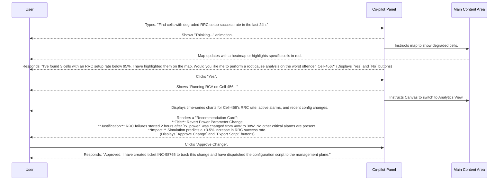

# RAN Co-pilot: UI/UX Direction

This document provides a comprehensive vision for the User Interface (UI) and User Experience (UX) of the RAN Co-pilot application. It is intended for the UI development team to use as a blueprint for building a professional, intuitive, and production-ready frontend.

---

### 1. The User Persona: The RAN Engineer

Our user is a technically proficient Radio Access Network (RAN) engineer or a Network Operations Center (NOC) operator.

-   **Goals:** Quickly diagnose network performance issues, perform root cause analysis, optimize cell parameters, and proactively identify future problems.
-   **Pain Points:** Sifting through countless dashboards, manually correlating disparate metrics (KPIs, alarms, CEM data), and slow, manual processes for implementing changes.
-   **Key Traits:** Data-driven, expert in their domain, values efficiency and accuracy, needs to trust the data and recommendations presented.

### 2. Core Design Principles

-   **Conversational First, Visual Second:** The primary interaction model is a conversation with the Co-pilot. The visual elements (maps, charts, tables) are powerful supporting tools that should be **driven by the conversation**. When the Co-pilot finds degraded cells, the map should update to show them. When it presents an analysis, a chart should appear.
-   **Clarity and Focus:** The user is often under pressure. The UI should present information with a clear visual hierarchy, avoiding clutter. Key insights should be highlighted.
-   **Context-Aware & Persistent:** The UI must maintain the context of the conversation. If the user is investigating "Cell-123," all relevant visual components should automatically filter for or focus on that cell. The conversation history should be persistent across sessions.
-   **Trustworthy & Actionable:** Every piece of data and every recommendation must be traceable. The user needs to see the *evidence* behind a recommendation. Actions (like creating a ticket or applying a configuration) should be presented as clear, explicit choices with a "human in the loop" for approval.

### 3. Key Screens & Components

We envision a "single pane of glass" dashboard, dominated by three main components:

**A. The Co-pilot Panel (The "Chat")**
-   **Location:** Likely a persistent sidebar (e.g., on the right).
-   **Functionality:**
    -   A clean, scrollable history of the conversation between the user and the agent.
    -   A prominent input box at the bottom for typing natural language queries.
    -   The Co-pilot's responses should be able to render not just text, but rich, interactive components. For example:
        -   **Recommendation Cards:** A structured card showing the `title`, `justification`, and `simulated_impact` of a recommendation, with clear "Approve" and "Reject" buttons.
        -   **Data Previews:** Small tables or summaries of data that can be expanded into the Main Content Area.
        -   **Clarification Prompts:** Buttons that allow the user to quickly answer a clarifying question from the agent (e.g., "I found 5 degraded cells. `Investigate All` or `Show on Map`?").

**B. The Main Content Area (The "Canvas")**
-   This is the largest part of the screen. Its content is dynamic and changes based on the conversation. It can switch between several views:
    -   **Geospatial View (Map):** The default view. A live map showing cell tower locations. This view is interactive:
        -   The Co-pilot can draw on it (e.g., "Here is a heatmap of the RSRP for this area.").
        -   The user can click on a cell, which should automatically trigger a query in the Co-pilot panel like, "Tell me about this cell."
    -   **Analytics View (Charts & Graphs):** When the Co-pilot presents time-series data, this view should display interactive charts (e.g., line charts for KPIs, bar charts for alarm counts). The user should be able to zoom, pan, and hover to see details.
    -   **Structured Data View (Tables):** For displaying lists of cells, alarms, or recommendations. These tables should be sortable, filterable, and allow the user to select a row to investigate further.

**C. The Global Dashboard Header**
-   A persistent header showing the most critical, high-level network KPIs (e.g., overall success rates, active critical alarms).
-   A global search bar that can also be used to initiate a conversation.
-   User account/settings menu.

### 4. Example User Workflow

### 5. Recommended UI Tech Stack

For a professional and interactive application like this, I would recommend a modern web stack:

-   **Frontend Framework:** **React** or **Next.js** (for its server-side rendering capabilities which can be useful for initial load performance).
-   **Component Library:** **Material-UI (MUI)** or **Ant Design**. These provide a rich set of pre-built, professional-looking components (buttons, tables, modals) that will accelerate development.
-   **Mapping Library:** **Mapbox GL JS** or **Leaflet**. Mapbox is more powerful and visually impressive, but Leaflet is a solid open-source alternative.
-   **Charting Library:** **D3.js** is the most powerful, but libraries like **Recharts** or **Nivo** provide excellent React-friendly wrappers that are easier to work with.
